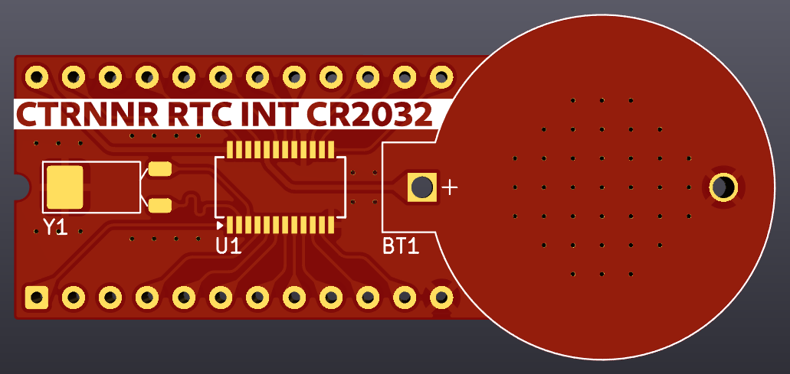

# Drop-in replacement for Odin RTC module

This is a modified version of Necroware/ScrapComputing nwX287 RTC module with the following features:
- It uses a common through-hole CR2032 battery holder instead of a CR1225
- It works with an BQ3285 SSOP-24 RTC IC
- It is locked in Intel mode

For detailed information about the project, please refer to:
- Necroware's original [project](https://github.com/necroware/nwX287) and [video](https://www.youtube.com/watch?v=svPNxILeQEw)
- ScrapComputing's modified [version](https://github.com/scrapcomputing/nwX287.cr2032.ssop.mot) and [video](https://www.youtube.com/watch?v=k7J6g3XWbXA)

## Bill of Materials
Gerber files are published in the releases: https://github.com/scrapcomputing/nwX287.cr2032.ssop.mot/releases

Part | # | Description
-----|---|-----------------------------------------
U1   | 1 | Real-Time Clock BQ3285S SSOP-24
Y1   | 1 | Crystal oscillator 32.768kHz 6pF
BT1  | 1 | CR2032 through-hole battery holder

